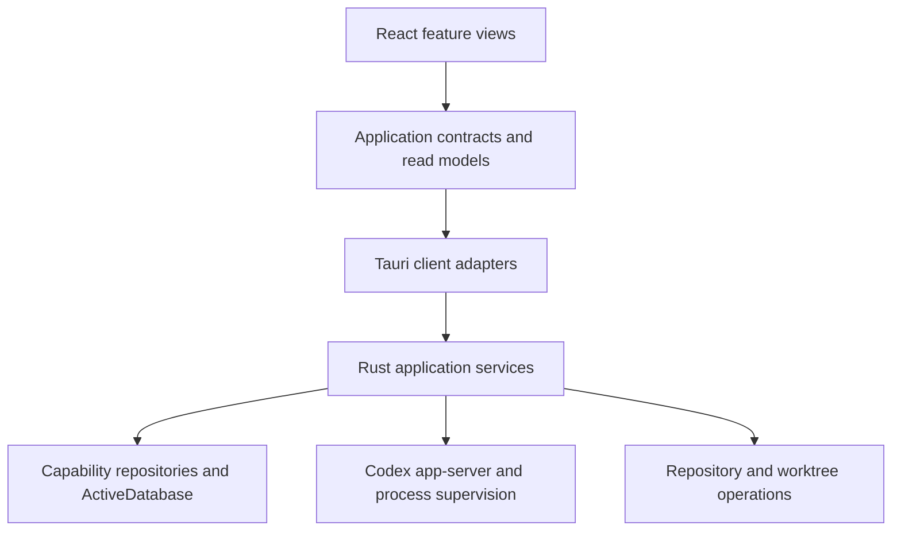

# Architecture

Codex Orchestrator is a local React/Tauri application. A durable Agent Session is the central interaction context; application-owned Workflows and the retained Epic/Sprint feature coordinate work around Sessions. Current composition is broader than the July recovery application that mounted only Agent Sessions.

This guide describes `60c3798`. Feature guides own their detailed contracts and decisions; [validation evidence](validation-evidence.md) records what was actually exercised at earlier checkpoints.

## Composition and dependency direction

`src/app/ApplicationRoot.tsx` constructs the product immediately. In Vite development mode, explicit query routes can substitute recorded compositions. Product startup uses `src/bootstrap/productApplicationComposition.ts`; it injects the native Session, Workflow, configuration, identity, repository, Worktree Review, File Review, Product Decision and orchestration clients. `src-tauri/src/active_app.rs` supplies native services, registers commands, and wires notifications and shutdown.

Views consume application contracts rather than raw repositories or IPC. Transport adapters map DTOs explicitly. Rust application services coordinate operations and effects; repositories own persistence mappings; runtime adapters and physical Git/build helpers own external effects. Read models make stored/observed facts usable for presentation without acquiring mutation authority.

There are real unsupported operations in product composition: generic artifact access and Epic/Sprint automatic-continuation policy controllers. Workflow continuation has its own active route. File Review has a scoped loader, native client and commands, but `active_app.rs` installs `ContextualFileReviewTauriState::unavailable`; `request_contextual_file_review` returns `not_ready` without that producer service. A fresh Sprint-context review is therefore unavailable at product boot. The [File Review guide](file-review.md) distinguishes the implemented viewer/loader from that missing connection.

## Capability boundaries

| Responsibility                                                 | Principal source owner                                                                          | Contract explained in                                 |
| -------------------------------------------------------------- | ----------------------------------------------------------------------------------------------- | ----------------------------------------------------- |
| Durable Session context, invocations and history               | `src-tauri/src/agent_sessions/`; `src/application/agentSessions/`                               | [Agent Sessions](agent-session/README.md)             |
| Provider interaction and supervised processes                  | `src-tauri/src/runtime/`; `src-tauri/src/active_app/sessions.rs`                                | [Agent Sessions](agent-session/README.md)             |
| Native homes, profile resolution and identities                | `src-tauri/src/native_profiles/`, `execution_configuration/`, `identities/`                     | [Execution configuration](execution-configuration.md) |
| Workflow authoring, compilation, instances and routing         | `src-tauri/src/workflows/`; `src/features/workflows/`                                           | [Workflows](workflows.md)                             |
| Generic Session Event addressing, materialization and delivery | `src-tauri/src/session_events/`                                                                 | [Workflows](workflows.md)                             |
| Shared local repository registrations and Git observations     | `src-tauri/src/repository_catalog/`                                                             | [Worktree Review](worktree-review.md)                 |
| Review selection and retained operational facts                | `src-tauri/src/worktree_review/`                                                                | [Worktree Review](worktree-review.md)                 |
| Physical capture, checkout, build and open operations          | `src-tauri/src/worktree_application/`                                                           | [Worktree Review](worktree-review.md)                 |
| Scoped read-only file review                                   | `src/application/fileReview.ts`; `src-tauri/src/orchestration/file_review_originating_entry.rs` | [File Review](file-review.md)                         |
| Epic/Sprint planning and execution                             | `src-tauri/src/orchestration/`                                                                  | [Epic/Sprint orchestration](orchestration/README.md)  |
| Product Decision versions and correction proposals             | `src-tauri/src/product_decisions.rs`                                                            | [Product Decisions](product-decisions.md)             |
| Shared product database assembly                               | `src-tauri/src/product_database/`, `storage.rs`, `persistence/active_database.rs`               | [ActiveDatabase](architecture/active-database.md)     |

Workflow consumes configuration vocabulary and compiles authoring state into generic Session Event definitions. Session Events express effects through directory and dispatch ports; they do not need Workflow or Agent Session internals. Agent Session integration implements those ports. Configuration resolution does not depend on Workflow presentation, and Agent identity does not determine runtime capabilities.

Typed identities and boundary validation keep different kinds of records distinct. A Workflow instance, logical Session address, durable Session, provider thread, invocation, delivery and execution attempt are related identities, not interchangeable IDs. Definition-time intent is also different from runtime observation: dispatching a request does not itself establish the application's semantic result.

## Persistence and filesystem ownership

The active product schema is assembled into `codex-orchestrator-active-v3.sqlite`; the inspected schema version is 48. Each capability owns its tables and repository contracts even though they share the physical database and managed access boundary. Read the [ActiveDatabase guide](architecture/active-database.md) for query-only reads, immediate writes, rollback and external-effect placement.

Worktree Review has a separate operational database. Product-owned skills and retained empty Session workspaces under the product home are distinct from Tauri application data, a selected native Codex home, repository checkouts and build output. A Session without a selected working directory receives a retained empty workspace; it is intentional Session state rather than a build cache.

The original Task implementation, its legacy TypeScript stack and all ten command registrations were removed at `ac18781`. `src-tauri/src/lib.rs` now contains module declarations and the two entry points. Current startup uses the active schema and leaves older database files untouched. The separate [retirement record](architecture/legacy-task-retirement-plan.md) and [real-agent verification](architecture/legacy-task-retirement-verification.md) preserve that work; [Rust boundary instructions](../src-tauri/AGENTS.md) retain their own owner.

## Presentation and recorded review

Shared controls such as `ProductViewHeader` express presentation hierarchy; their use in one screen does not imply every feature has adopted them. Feature UI state, asynchronous loading and saved-draft ownership stay with the owning feature. Recorded clients demonstrate views with supplied facts; they are not alternative sources of product state or proof of live runtime behavior.

See [development](development.md#recorded-review-routes) for the currently mounted recorded routes. The optional inspector remains a development tool with explicit process and evidence inputs, separate from the product's semantic API.

## Why these boundaries exist

The original user request emphasized useful overviews of related AI work and clear conceptual separation. The later recovery discussion established a richer interaction context behind the visible conversation and approved a real process supervisor plus a concrete Codex adapter. This supports the responsibility split above, without making early class names or hypothetical providers enduring requirements. Source: task `019f48bb-85b0-7451-bf2c-5483a36a18ff`, original user messages at raw rollout lines 424, 645 and 823.

The Session Event redesign made configuration, identity, generic event delivery and Workflow authoring independently understandable. Its dependency and validation rationale is preserved by `e2bfc6c:docs/session-event-model/conceptual-model.md` and `e2bfc6c:docs/session-event-model/contract-rules.md`; present source determines which parts are implemented. Existing arrangements are not reasons to add a framework or an interface for every function.

The shared database and repository boundaries arose from actual concurrent-write and inconsistent-repository problems. Their decisions live in [ActiveDatabase](architecture/active-database.md) and [Worktree Review](worktree-review.md). The old development control-room roles are historical context, not instructions for the running product; see [project evolution](project-evolution.md).
