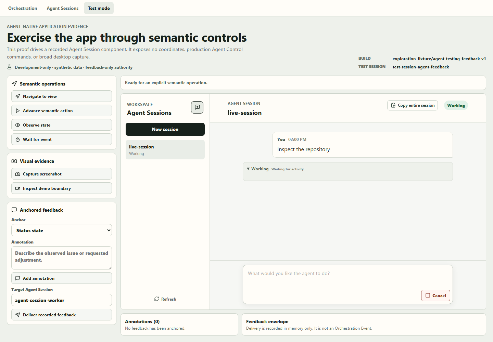

# Agent-native Application Testing / Test Mode

Offline product-owner review package for exploration commit `8c7ccd1` on
`codex/explore-agent-testing-feedback`.

## What this direction proposes

An application-owned Test Session exposes a small semantic contract:

- navigate to an allowlisted view;
- act through allowlisted element and action IDs;
- observe structured view state and elements;
- wait for typed conditions with a bounded timeout;
- request evidence through an app-owned capture boundary;
- attach annotations to a view, element, state, frame reference, or timeline point;
- deliver a versioned, explicitly non-authoritative feedback envelope.

This is intentionally not coordinate automation. It exposes no arbitrary selectors, scripts,
filesystem operations, process control, or broad desktop capture. A future agent adapter should be
a product-owned, invocation-scoped boundary such as MCP, separate from production Agent Control.

## Actual in-app proof



The development route `/?agent-test-mode` uses the normal App shell. It adds **Test mode** beside
**Orchestration** and **Agent Sessions**, then selects it initially. The view embeds the real Agent
Session presentation component, supplied by recorded synthetic data.

Production composition receives no development surface. The proof is loaded only by Vite
development mode with the explicit query flag.

## View it offline

Prerequisites:

- the accepted worktree remains at
  `C:\Users\user\.codex\worktrees\0e46\Codex Orchestrator`;
- `git rev-parse --short HEAD` reports `8c7ccd1`;
- Node.js and npm are installed;
- that worktree's existing `node_modules` directory is present. Do not run `npm install` while
  offline.

In PowerShell:

```powershell
Set-Location 'C:\Users\user\.codex\worktrees\0e46\Codex Orchestrator'
git rev-parse --short HEAD
Test-Path .\node_modules
npm run dev
```

Open [http://localhost:1420/?agent-test-mode](http://localhost:1420/?agent-test-mode). Vite uses
strict port `1420`; stop it with `Ctrl+C`. This launches only the local recorded proof and does not
require an Agent Session or provider prompt.

If the worktree or dependencies are unavailable, review the screenshot and this package without
running the app.

## Suggested walkthrough

1. Confirm the shared top navigation shows Orchestration, Agent Sessions, and selected Test mode.
2. Select **Navigate to view**, then **Observe state**.
3. Select **Advance semantic action** and confirm the structured event count changes.
4. Select **Wait for event**; the wait uses a typed condition and bounded timeout.
5. Select **Capture screenshot**. It should report that no app-window pixel adapter is connected.
6. Select **Inspect demo boundary**. It should identify one app-owned root and say an adapter is
   required.
7. Add an annotation anchored to the view, status state, transcript element, or recorded timeline.
8. Select **Deliver recorded feedback** and inspect the `application_test_feedback/v1` envelope.

## Truthful boundaries

| Area           | Present in this proof                                                      | Not present                                                                |
| -------------- | -------------------------------------------------------------------------- | -------------------------------------------------------------------------- |
| Control        | Semantic navigation, action, observation, and bounded waits                | Coordinates, arbitrary selectors, scripts, filesystem or process control   |
| Data           | Recorded Agent Session fixture; synthetic-only scope                       | Live provider, real user data, product Agent Sessions                      |
| Screenshot     | Typed request that fails closed                                            | Pixel capture or evidence artifact                                         |
| Demo video     | Build/session/root envelope with excluded-data declarations                | Recording, audio, encoding, or persisted media                             |
| Annotations    | In-memory anchors for view, element, state, or timeline                    | Durable retention, frame attachment, redaction workflow                    |
| Feedback       | Versioned `feedback_only` envelope delivered to an in-memory recorded sink | Product Agent Session delivery, Orchestration Event, Agent Control command |
| Agent boundary | Candidate future invocation-scoped MCP direction                           | MCP server, Tauri bridge, production authority                             |

The screenshot in this package is manually captured static review evidence. It is not output from
the unavailable in-app screenshot adapter.

## Current limits

- There is no Test Session MCP server or Tauri command bridge.
- The displayed build reference is a fixture identity, not executable attestation.
- Pixel screenshot and video capture are unavailable.
- Feedback is in memory, not durable, and not connected to a product Agent Session.
- Annotations are in memory and are not attached to captured frames.
- Worktree, port, database, process, and application-state isolation remain unproven.

## Product choices needing review

- Is the tester a separate Agent Session or a scoped capability of the implementing Agent Session?
- What proves build identity: commit plus dirty-tree digest, packaged binary digest, or both?
- Must the user approve every demo before feedback reaches the implementing agent?
- How long are annotations retained, and how are deletion and redaction handled?
- May an isolated capture include transient Agent Session text inside its declared app root?

Record decisions in [REVIEW-CHECKLIST.md](REVIEW-CHECKLIST.md).

## Candidate next product slice

Build **Test Session Host v1** as a debug-only Rust/Tauri module:

1. Open one isolated synthetic Test Session window bound to a commit and dirty-tree digest.
2. Start one invocation-scoped MCP server exposing only:
   `describe_test_session`, `navigate_test_view`, `perform_test_action`, `observe_test_view`,
   `wait_for_test_condition`, and `capture_test_view_png`.
3. Bridge those tools to a frontend semantic registry for that isolated window.
4. Capture only the declared app root and persist a PNG with a build/session/view manifest.
5. Prove invalid semantic IDs, missing credentials, cross-session access, terminal cleanup, and app
   shutdown fail closed.

Do not include video recording or product feedback delivery in that slice. Establish isolation and
trustworthy still-image evidence first.

## Package contents

- `README.md` - direction, launch steps, boundaries, decisions, and next slice.
- `REVIEW-CHECKLIST.md` - offline walkthrough and decision record.
- `assets/test-mode-peer-tab.png` - inspected static evidence.
- `assets/EVIDENCE.md` - provenance and non-claims for the screenshot.
