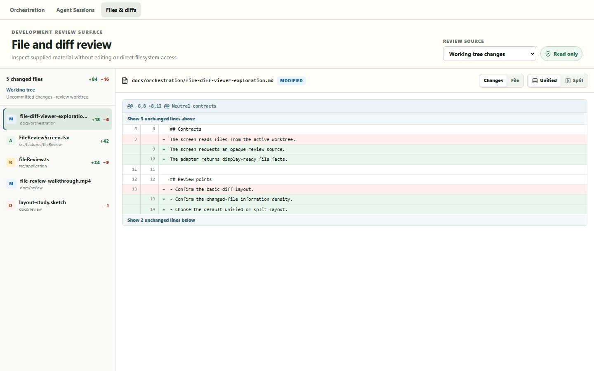
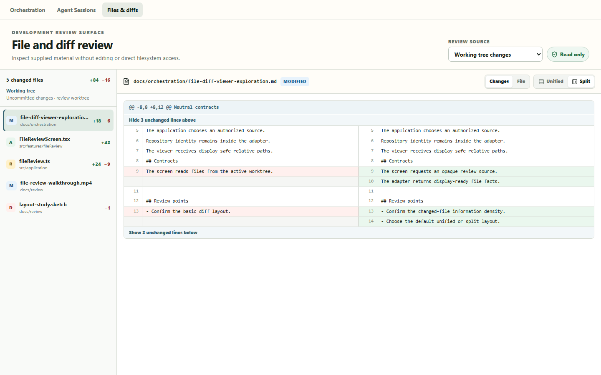
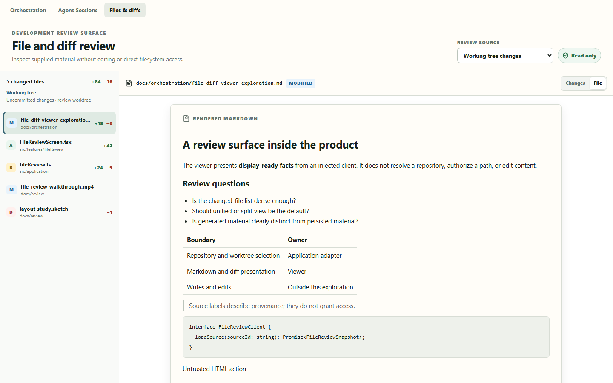
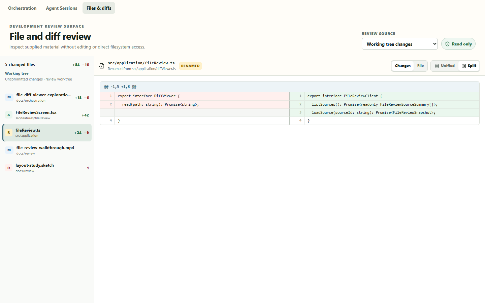
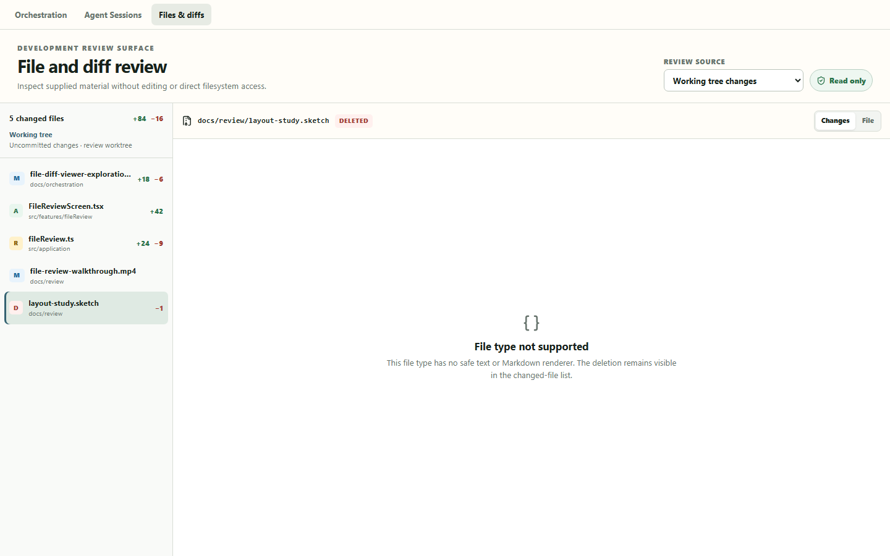
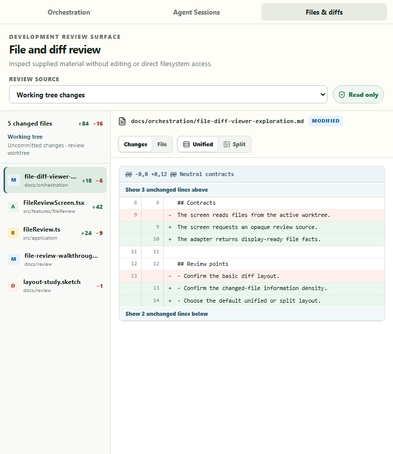

# File and Diff Viewer offline review

Status: accepted adjacent exploration, isolated on `codex/explore-file-diff-viewer` at commit
`9de25c2`. It has not been merged or pushed.

This package is for offline product review. It contains instructions, a review checklist, and six
representative screenshots. It does not require Agent Sessions, network access, or provider calls.

## Offline launch

Prerequisites confirmed on 2026-07-17:

- Worktree:
  `C:\Users\user\.codex\worktrees\26b6\Codex Orchestrator`
- Node `v24.14.1` and npm `11.11.0`
- Existing `node_modules` with Vite available
- Branch `codex/explore-file-diff-viewer` at `9de25c2`

Open PowerShell and run:

```powershell
Set-Location -LiteralPath 'C:\Users\user\.codex\worktrees\26b6\Codex Orchestrator'
git status --short --branch
git rev-parse --short HEAD
Test-Path -LiteralPath 'node_modules\.bin\vite.cmd'
npm run dev -- --host 127.0.0.1 --port 4173
```

Expected checks: the branch is `codex/explore-file-diff-viewer`, the commit is `9de25c2`, and the
Vite check is `True`.

Then open:

<http://127.0.0.1:4173/?file-diff-viewer>

Select the **Files & diffs** tab if it is not already active. Do not run `npm install` while
offline. Do not use a production build for this review: the recorded tab is intentionally enabled
only in Vite development. Press `Ctrl+C` in PowerShell to stop the server.

## What the demonstration is

**Files & diffs** is an actual peer tab in the application shell, not a standalone HTML harness.
It appears only when the development composition injects a `FileReviewClient`. The same component
tree presents every source and file state.

The demo supports:

- changed-file navigation with additions and deletions;
- working-tree, staged, commit-range, generated-material, and application-owned source labels;
- hunks and expandable unchanged context;
- unified and side-by-side inspection;
- rendered Markdown and plain text;
- added, modified, renamed, and deleted files;
- explicit binary and unsupported states; and
- a narrow desktop layout.

Use [REVIEW-CHECKLIST.md](REVIEW-CHECKLIST.md) for the recommended walkthrough.

## Authority and trust boundary

The presentation receives display-ready facts only.

| Concern                                                            | Owner               |
| ------------------------------------------------------------------ | ------------------- |
| Repository and worktree identity                                   | Application adapter |
| Source collection and path/read authorization                      | Application adapter |
| Opaque source selection                                            | `FileReviewClient`  |
| Display-safe relative paths, Markdown, text, and diff presentation | Viewer              |
| Open path, copy path, edit, stage, discard, and writes             | Outside the viewer  |

The UI does not import Git, repository, worktree, artifact, Tauri, or write adapters. Displayed paths
are labels, not filesystem handles. Markdown reuses `AgentMarkdown`, which skips raw HTML. Binary and
unsupported inputs fail closed to named states.

## Recorded versus live

All five demonstration sources are deterministic recorded fixtures from
`src/dev/fileReview/recordedFileReviewClient.ts`. The working-tree, staged, and commit-range labels
describe the fixture's provenance class; they do not prove live Git collection. Generated and
application-owned examples are also recorded and are labeled as such.

No live repository, artifact store, Tauri command, provider, or Agent Session is contacted during
this walkthrough.

## Product decisions to review

- Is the changed-file list dense enough, and are additions/deletions placed well?
- Should unified or split view be the default?
- Are generated, persisted application-owned, and repository-derived sources distinct enough?
- Are rename, delete, binary, and unsupported states clear without implying unavailable actions?
- Is the 780px narrow desktop state still useful?

## Known gap and limits

Known integration requirement: if `listSources()` returns an empty collection, the screen remains
in its loading state. The first real integration must add an explicit no-sources state and tests.

Other deliberate limits:

- recorded fixtures do not prove live Git or artifact integration;
- hunks arrive parsed and display-ready;
- parsing, encoding detection, size limits, truncation, and unavailable-artifact handling are absent;
- split pairing is line-oriented, without word-level alignment;
- no syntax highlighting, search, comments, media playback, or large-file virtualization; and
- no file, repository, index, or artifact writes.

## Candidate first integration

A sensible candidate, not an authorization, is:

1. Resolve one authorized application-owned changed-files Document and stored diff artifact.
2. Map them to `FileReviewSnapshot`.
3. Open the existing viewer from Sprint Documents.
4. Prove identity, authorization, empty sources, size limits, encoding, binary detection, and
   unavailable artifacts.

Live working-tree collection and every write action remain outside that candidate slice.

## Representative evidence

### 1. Desktop unified review

The default working-tree fixture shows changed-file navigation, counts, one hunk, and context
expansion controls.



### 2. Split review

The same hunk switches to side-by-side inspection without changing source or file.



### 3. Safe Markdown

Markdown uses the product renderer. Raw HTML is not interpreted as an interactive control.



### 4. Rename

The current display path, previous display path, rename badge, and paired changes remain visible.



### 5. Unsupported deleted file

The deleted file stays in navigation while content fails closed to an explicit unsupported state.



### 6. Narrow desktop

At 780px, unified mode reflows without page, workspace, inspector, or diff-body horizontal
overflow. Split mode intentionally retains a wider inspection surface.


