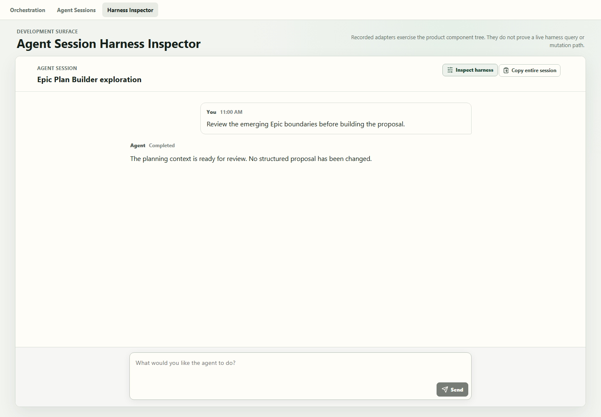

# Harness Inspector offline review

Status: accepted adjacent exploration, isolated on `codex/explore-harness-inspector` at
`f3e332a`. It has not been merged or pushed.

## What to review

The exploration tests one opinionated interaction:

1. A product context that has harness data places **Inspect harness** over its Agent Session pane.
2. Opening it replaces the conversation pane with one read-only inspector.
3. **Back to conversation** restores the pane.
4. The inspector presents prompt/context, skills, MCP tools, model/reasoning,
   sandbox/authority, hooks, validation, provenance, and proposed safe-apply rules.

Agent Session itself remains harness-neutral. The product wrapper supplies an application read
boundary; the inspector renders that read model.



The screenshot is the recorded development surface before opening the inspector. It provides static
evidence of the injected application tab and over-pane control; use the offline steps below to review
pane replacement and the full inspector.

## Launch it offline

Prerequisites were verified locally on 2026-07-17: Node `v24.14.1`, npm `11.11.0`, Microsoft Edge,
and the worktree's installed Vite/React dependencies are present. No install or network access is
needed.

In PowerShell:

```powershell
Set-Location -LiteralPath 'C:\Users\user\.codex\worktrees\37c4\Codex Orchestrator'
git status --short --branch
git rev-parse --short HEAD
& .\node_modules\.bin\vite.cmd --host 127.0.0.1 --port 1420
```

Confirm the branch is `codex/explore-harness-inspector`, the commit is `f3e332a`, and the worktree
is clean. Keep that PowerShell window open, then visit:

`http://127.0.0.1:1420/?harness-inspector`

Stop the local server with `Ctrl+C`. The route must be opened in Vite development mode; production
composition intentionally does not expose this surface.

## Suggested five-minute review

1. Notice the development-only **Harness Inspector** application tab and the recorded Agent Session.
2. Select **Inspect harness** in the upper-right of the session pane.
3. Confirm the entire conversation pane is replaced and **Back to conversation** is obvious.
4. Check that the prompt card says **Profile configuration · Read only**, delivery says
   **Delivery not evidenced**, and validation says **Validation unverified**.
5. Scan the remaining cards and the disabled **Apply changes** area.
6. Return to the conversation and record decisions in [REVIEW-CHECKLIST.md](./REVIEW-CHECKLIST.md).

## Recorded versus live

| Shown in this demonstration                | What it proves                                                              |
| ------------------------------------------ | --------------------------------------------------------------------------- |
| Checked-in Conversation Harness v2 catalog | The recorded adapter can parse and present the Epic Plan Builder profile.   |
| Recorded Agent Session and transcript      | The existing Agent Session component tree can host the wrapper interaction. |
| Passed shape checks                        | Catalog schema and selected policy fields satisfy this adapter's checks.    |
| `Delivery not evidenced`                   | No durable observation proves the configured prefix reached this session.   |
| Unverified skill source                    | A recorded canonical path does not prove repository discovery or skill use. |
| Disabled apply controls                    | Safe semantics can be reviewed, but no persistence or mutation exists.      |

Nothing here is a live provider query, live harness lookup, durable session binding, runtime catalog
load, skill discovery proof, authorization decision, or mutation path. Do not send prompts from this
fixture as product evidence.

## Product choices

The review is primarily about:

- whether the over-pane control is discoverable without competing with session actions;
- whether replacement plus a clear return is better than a modal, drawer, or separate settings page;
- whether one scrollable inspector is clearer than nested tabs;
- whether **Profile configuration**, **Future invocation**, and **Application owned** are the right
  scope labels while delivery evidence remains separate;
- whether prompt/context should be expanded by default;
- which fields, if any, should later become editable;
- whether validation, stale-revision rejection, new-version creation, and separate configuration
  versus activation provenance are sufficient prerequisites for apply work.

## Limits and next slice

This is one recorded design, not a settings framework. It exposes only the Epic Plan Builder profile
and adds no product query, editor state, persistence command, live mutation, or provider proof.

The candidate next product slice is read-only Epic Plan Builder integration:

1. add an application-owned query for the bound profile, catalog revision, and durable first-query
   delivery evidence for one Agent Session;
2. adapt that query to the existing inspector source contract;
3. wrap the Epic Plan Builder Agent Session pane and expose the control only after a successful
   bound read;
4. prove unavailable, invalid-catalog, unbound-session, delivered, and not-yet-delivered states.

Editing is deliberately excluded. This slice is a planning candidate, not authorization to build it.
See [ARCHITECTURE.md](./ARCHITECTURE.md) for the source map and accepted evidence.
