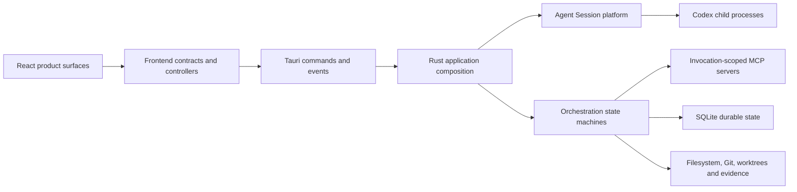

# Current orchestration product and system

This is the shortest supported reading of the implementation currently known as the Epic workflow. It describes the stable research snapshot at `9240364`; [near-future and moving work](near-future-and-moving-work.md) is kept separate so it does not silently become current product behavior.

## Product shape

The implementation supports a connected lifecycle:

1. A user develops an Epic with a managed Plan Builder and explicitly confirms initiation.
2. An application-owned bootstrap Session prepares durable materials and activates an Epic Runner.
3. The Epic Runner starts a Sprint; Sprint and Work Slice planning turn current context into bounded Work Units.
4. Handler and Implementer Sessions work through isolated workspaces, application-scoped tools and immutable Harness revisions.
5. The application captures evidence separately from agent claims, routes review, retains accepted candidates and integrates accepted work.
6. Dependency progression, retry, escalation, handback and settlement remain distinct durable outcomes.

Agent Sessions are the shared runtime spine. Native Profiles, Harnesses, MCP servers, Git authority, File Review and internal review tooling provide execution, policy, evidence and oversight around it.

## Current capability surface

| Area | Current reading | Main evidence |
| --- | --- | --- |
| Agent Sessions | Productive shared conversation and managed-agent runtime | [runtime comparison](../evidence-passes/agent-runtime-comparative-pass.md) |
| Epic Plan Builder | Productive conversation, durable proposal and explicit initiation entry | [proposal and initiation trace](../operation-traces/plan-builder-proposal-and-initiation.md) |
| Bootstrap, Epic and Sprint control | Productive backend control plane with substantial automatic reconciliation | [capability landscape](../catalogs/capability-landscape.md) |
| Work Slice and Work Unit execution | Deep productive path through planning, isolated execution, reporting, review and integration | [execution and settlement trace](../operation-traces/work-unit-execution-review-and-settlement.md) |
| Harness revisions | Productive executable policy; runtime authoring is largely automatic rather than a fully connected management product | [Harness and configuration](../catalogs/harness-and-configuration.md) |
| Invocation-scoped MCP | Productive managed-agent capability boundary implemented by several specialized loopback servers | [MCP catalogue](../catalogs/mcp-servers-and-tools.md) |
| Native Profiles | Release-visible identity and readiness control; selected ready `CODEX_HOME` gates shared launches, while broader execution policy remains split | [native and managed runtime](../evidence-passes/native-and-managed-runtime-pass.md) |
| File Review | Stored opaque artifacts can be viewed in release; contextual production is debug-composed in this snapshot | [review surfaces](../evidence-passes/review-surfaces-pass.md) |
| Human and Worktree Review | Substantial internal/debug product and evidence tooling, not a release product surface | [review surfaces](../evidence-passes/review-surfaces-pass.md) |
| Legacy Tasks | Retained compatibility implementation behind explicit release quarantine | [legacy quarantine](../evidence-passes/legacy-task-quarantine-pass.md) |

## System shape

Tauri primarily composes the desktop application, registers frontend commands, emits two event families and owns application startup/exit hooks. Most domain, persistence, orchestration, MCP, process and Git behavior is implemented in ordinary Rust modules inside the same crate. The exact split is catalogued in [Rust backend and Tauri](../catalogs/backend-and-tauri.md) and [Tauri operations](../catalogs/tauri-operations.md).

## What most affects the current explanation

- A capability can be present in source or registered with Tauri without being product-reachable or effectful.
- Managed agents share one runtime, but their effective behavior is assembled from durable orchestration facts, Harness revisions, generated prompts, MCP injection, Native Profile identity, environment and process policy.
- The checkout used to compile the Rust backend currently supplies productive Sprint planning and Git-integration authority.
- Backend reconciliation can advance durable work before or faster than the surrounding frontend projection refreshes.
- Several substantial capabilities exist only on sibling or moving lines and are not part of this stable snapshot.

These are current implementation findings, not rules for future architecture.

## Continue by purpose

- Product scope and value: [product-owner reading](../perspectives/product-owner.md)
- System boundaries and authority: [product-architect reading](../perspectives/product-architect.md)
- Exact implementation locations: [code artifact map](../catalogs/code-artifact-map.md)
- Frontend and reusable views: [frontend experience map](../catalogs/frontend-experience-map.md)
- Current and nearby implementation lines: [near-future and moving work](near-future-and-moving-work.md)
- Detailed evidence and exceptions: [evidence passes](../evidence-passes/README.md)
- Visual review: [interactive orchestration insight atlas](../visualizations/product-map/README.md)
