# Observation pass: effective Implementer reporting launch

## Boundary and conclusion

This traces one concrete launch contract at source tip `924036424969de293da17d0e29c67c34d1ec7c81`: the same-Agent-Session continuation that reports the outcome of a completed Work Unit Implementer attempt.

The effective contract is not stored in one Harness record. It is assembled across the immutable Harness revision, execution-support grant, transition code, invocation-scoped MCP server, selected Native Profile, generic Agent Session lifecycle, Codex argument builder, inherited desktop environment, and direct-child process supervisor.

The concise result is:

- The process receives a `workspace-write` sandbox, approval `never`, an exact worktree trust override, ignored rules, cleared inherited MCP servers, exactly two application MCP tools, and a special network/proxy exception.
- The selected Native Profile is a mandatory identity/readiness gate and supplies `CODEX_HOME`, but this path does not use the Native Profile service's stricter general launch projection.
- The generic process launcher inherits the complete desktop environment and overlays only the MCP bearer variable and `CODEX_HOME`.
- “Same-Session continuation” normally becomes `codex exec resume`, but source enforcement is conditional on the Session already having a persisted external context ID. Without one, this exact path starts a fresh `codex exec` invocation.
- Launch acceptance immediately becomes the transition's `reporting_ready_at`; it does not prove provider activity, MCP connection, or a tool call.
- Tool success remains non-accepting. Application acceptance requires valid claims, application-captured immutable evidence, exact semantic completion, and a `Completed` terminal lifecycle.

## Concrete flow

```mermaid
flowchart LR
    A["Original Implementer invocation: Completed"] --> B["Application seals and revalidates candidate"]
    B --> C["Pin reporting Harness revision and deterministic invocation"]
    C --> D["Start invocation-scoped loopback MCP server"]
    D --> E["Persist application-owned pending invocation"]
    E --> F["Native Profile identity and readiness gate"]
    F --> G["Generic Codex capability preflight"]
    G --> H["Spawn direct child with assembled args and env overlay"]
    H --> I["Submit claims, then capture evidence and complete semantically"]
    I --> J["Persist terminal lifecycle and stop MCP server"]
    J --> K["Revalidate bundle, application-accept, ready Handler review"]
```



No arrow above is inferred from transcript prose. Each is a separate application or runtime boundary.

## Symbols used below

| Symbol | Runtime value and authority |
| --- | --- |
| `ATTEMPT` | Application-owned Work Unit attempt ID. |
| `SESSION` | The already-created Implementer Agent Session for `ATTEMPT`. |
| `ORIGINAL_INVOCATION` | The actionless source-editing invocation in `SESSION`. |
| `REPORTING_INVOCATION` | `stable_id("work-unit-implementer-reporting-invocation", ATTEMPT)`. |
| `WD` | Absolute isolated execution-worktree path from the execution-support grant. |
| `REVISION`, `DIGEST`, `COMMIT_REF` | Immutable reporting Harness identity stored with the outcome row. |
| `MCP_NAME` | `work_unit_implementer_reporting_<random UUID without separators>`. |
| `MCP_URL` | `http://127.0.0.1:<ephemeral port>/mcp`. |
| `TOKEN_ENV` | `CODEX_ORCHESTRATOR_MCP_<random UUID without separators>`. |
| `TOKEN` | Random bearer value held in memory and supplied only through `TOKEN_ENV`. |
| `PROFILE_HOME` | Canonical selected Native Profile directory supplied as `CODEX_HOME`. |
| `CONTEXT_ID` | Persisted external Codex thread/context ID for `SESSION`, when one exists. |

## 1. What is required before launch assembly begins

The trigger is not merely an Implementer process exit. `reconcile_implementer_reporting_continuations` requires the exact original invocation to be durably `Completed`. It then:

1. Seals the already-authorized worktree through the application-owned Git seam. WorkspaceWrite cannot write protected Git metadata, so the application runs `git add --all` and creates the candidate commit.
2. Reloads the original immutable Implementer revision by its stored revision ID, configuration digest, and repository commit reference, and requires it to remain actionless: no required MCP and no tools.
3. Reconstructs the execution package from that pinned profile and the existing execution-support grant.
4. Requires a nonempty changed-file manifest, comparison, capture authorization, and evidence content for every manifest item. Inspection requires the worktree to be clean and its current commit to differ from the attempt baseline.
5. Obtains or publishes a distinct immutable reporting revision, stores `REVISION`, `DIGEST`, and `COMMIT_REF`, and reserves `REPORTING_INVOCATION` in the same `SESSION`.

Primary artifacts:

- `src-tauri/src/orchestration/sprint_runner_transition.rs:2468-2553`
- `src-tauri/src/orchestration/execution_support.rs:443-558`
- `src-tauri/src/orchestration/work_unit_execution_harness.rs:272-338`

The candidate evidence gate was added deliberately in commit `6588275` (`fix: gate implementer reporting on candidate evidence`).

## 2. Immutable configuration that becomes executable authority

The reporting revision is created by copying the initial Implementer revision and changing only its reporting prompt, tool whitelist, schema boundary, and completion-hook description. Its accepted runtime shape is:

| Field | Effective value |
| --- | --- |
| Machine key | `work_unit_implementer` |
| Model | none selected by the Harness |
| Reasoning effort | none selected by the Harness |
| Sandbox | `workspace_write` |
| Approval policy | `never` |
| Tool discovery | whitelist |
| Required tools | `submit_implementation_outcome`, then `complete_implementation_outcome` |
| Completion criterion | semantic completion plus application-observed terminal lifecycle |
| Product skill | `work-unit-implementer` at `.agents/product-skills/work-unit-implementer/SKILL.md` |

The revision parser rejects a different machine key, non-whitelist discovery, any other tool list or tool policy, a non-WorkspaceWrite sandbox, or an approval policy other than `never`. Reopen loads the immutable record by all three stored identities; it does not consult the current mutable catalog for the attempt.

Primary artifacts:

- `src-tauri/src/orchestration/conversation_harness_catalog.json:247-272`
- `src-tauri/src/orchestration/conversation_harness.rs:292-335`
- `src-tauri/src/orchestration/work_unit_execution_harness.rs:284-335`

Relevant history confirms the intent: `0d68629` hardened whitelist/tool-policy validation so a reporting revision cannot silently widen its declared tools.

## 3. Package-level launch material

`package_runtime_launch_configuration` turns the pinned profile and `WD` into requested options plus an extension.

Requested runtime options:

```text
model   = None
sandbox = WorkspaceWrite
```

Extension arguments, in order before the MCP injection is appended:

```text
-c
approval_policy="never"
--ignore-rules
-c
mcp_servers={}
-c
projects.'<lowercase, single-quote-escaped WD>'.trust_level="trusted"
```

The trust override is derived from the application-owned execution-support grant. It is needed because a private `CODEX_HOME` may not trust a newly created worktree, and approval `never` would otherwise reduce the requested writable invocation. The package denies launch if `WD/.codex` exists because Codex `0.144` can load trusted project configuration after command-line overrides. The package also clears inherited MCP servers before adding the exact reporting endpoint.

Important negative facts:

- `--strict-config` is absent.
- `--ignore-user-config` is absent.
- `--ignore-rules` is present.
- Local `WD/.codex` is fail-closed before process start.
- Other selected-Profile user configuration is not generally erased by this launch path unless one of the explicit later overrides supersedes it.

Primary artifact: `src-tauri/src/orchestration/work_unit_execution_harness.rs:431-461, 498-505, 628-679`.

The local-discovery denial and `mcp_servers={}` reset were added deliberately in `d34e8d2` (`fix: fail closed trusted Implementer discovery`).

## 4. Invocation-scoped MCP authority

Before persisting/launching the reporting invocation, the transition binds an ephemeral loopback server to `REPORTING_INVOCATION`. The adapter derives every Work Unit, attempt, Session, revision, and evidence identity from that invocation. Tool inputs cannot select them.

The injection appends these nine `-c` pairs, in order:

```text
mcp_servers.<MCP_NAME>.url="<MCP_URL>"
mcp_servers.<MCP_NAME>.bearer_token_env_var="<TOKEN_ENV>"
mcp_servers.<MCP_NAME>.enabled_tools=["submit_implementation_outcome","complete_implementation_outcome"]
mcp_servers.<MCP_NAME>.required=true
mcp_servers.<MCP_NAME>.default_tools_approval_mode="approve"
mcp_servers.<MCP_NAME>.startup_timeout_sec=10
mcp_servers.<MCP_NAME>.tool_timeout_sec=300
sandbox_workspace_write.network_access=true
features.network_proxy=true
```

The environment extension gains:

```text
TOKEN_ENV = TOKEN
```

The listener requires the exact bearer and `Host: 127.0.0.1:<port>`. If an `Origin` header is present, it must be `tauri://localhost`; absence of `Origin` is accepted. The server is held in an in-memory registry keyed by `REPORTING_INVOCATION` and stopped on that invocation's terminal notification or service shutdown.

The last two configuration values are broader process policy, not merely endpoint coordinates. They enable WorkspaceWrite networking and the network proxy so Codex `0.144` can reach the local MCP transport. Commit `289f29a` moved this exception out of generic MCP injection and made it specific to this reporting continuation. It is intentionally the sole WorkspaceWrite MCP transport exception in this code.

Primary artifacts:

- `src-tauri/src/orchestration/mcp.rs:39-149`
- `src-tauri/src/orchestration/sprint_runner_transition.rs:1551, 4430-4433, 4460-4473`

The process still has WorkspaceWrite file authority in `WD`; it is not a read-only reporter. Retained post-seal mutations make execution-support inspection fail because evidence capture requires a clean worktree, but the sandbox itself does not prevent the attempted mutation.

## 5. Persisted invocation and exact prompt

The application first persists a pending invocation with:

- deterministic `REPORTING_INVOCATION`;
- `SESSION` from the original Implementer;
- application input provenance;
- the transition-authored reporting prompt;
- requested model `None` and sandbox `WorkspaceWrite`;
- `WD`, required to match the durable Session working directory.

Only after that does it mark `reporting_prepared_at`, bind the package to the exact Session/invocation, and mark `reporting_harness_bound_at`.

The persisted `submitted_text` is exactly:

> Work Unit Implementer reporting continuation. Invoke submit_implementation_outcome with exactly one ReviewPending outcome containing summary and validationStatement claims, then invoke complete_implementation_outcome. Do not finish without both operations and do not use any other tool. Claims are not evidence; tool success is not application acceptance or Handler review. Do not move later workflow.

At process launch, the runtime prepends an application context generated from the immutable revision. Its content begins:

> You are the Work Unit Implementer reporting continuation for one completed isolated attempt. Use only submit_implementation_outcome and complete_implementation_outcome. Submit one ReviewPending summary and validation statement as claims. The application derives every identity and captures file evidence itself. Claims are not evidence, and tool success is not application acceptance or Handler review. Do not accept, review, return, retry, settle, activate dependents, or continue a Sprint or Epic.

It then appends the inherited product-skill guidance and renders the final prompt as:

```text
<application_context provenance="product_initial_prompt_prefix"
                     source="work_unit_implementer"
                     version="<reporting revision source draft number>">
<reporting revision context plus skill guidance>
</application_context>

<user_query>
<the exact transition-authored prompt above>
</user_query>
```

Primary artifacts:

- `src-tauri/src/orchestration/sprint_runner_transition.rs:2527-2553`
- `src-tauri/src/orchestration/conversation_harness.rs:477-517`
- `src-tauri/src/agent_sessions/ports.rs:195-220`
- `src-tauri/src/agent_sessions/application/lifecycle.rs:343-417, 679-695`

The persisted Agent Session invocation retains the transition prompt, not the rendered prompt containing the immutable prefix.

## 6. Selected Native Profile gate

Every managed Agent Session launch at this tip passes through `NativeProfileLaunchAuthority` before generic Codex capability preflight.

The reporting continuation is denied unless exactly one selected profile:

- is still active and has validated filesystem continuity;
- is authenticated;
- has confirmed sandbox initialization;
- has passed the WorkspaceWrite canary;
- has application-correlated MCP reporting readiness.

The service rejects any caller-supplied `CODEX_HOME`. It requires `SESSION` to retain the same selected profile ID and filesystem identity already bound by the original Implementer launch. It stores per-invocation launch provenance with mode `start` or `resume`, then appends:

```text
CODEX_HOME = PROFILE_HOME
```

The effective extension environment order is therefore:

```text
1. TOKEN_ENV = TOKEN
2. CODEX_HOME = PROFILE_HOME
```

Primary artifacts:

- `src-tauri/src/native_profiles.rs:2393-2498, 3804-3818`
- composition in `src-tauri/src/active_app.rs:140-152`

This universal managed-session gate was introduced at the inspected tip in commit `9240364` (`Bind managed sessions to ready native profiles`). The older reporting design acquired this additional authority boundary without changing its transition code.

## 7. Generic Codex preflight and final argument vector

The generic runtime chooses mode from `SESSION.runtime_binding.external_context_id`:

- `Some(CONTEXT_ID)` means Resume.
- `None` means Start.

It probes/caches the installed Codex CLI's structured-event, model, and sandbox support. WorkspaceWrite support must be known supported or the launch fails closed. No model flag is emitted because the Harness selected none.

### Expected successful same-thread Resume vector

This is launch-command order (program followed by its argument vector), not shell quoting:

```text
codex
exec
resume
--json
-c
sandbox_mode="workspace-write"
-c
approval_policy="never"
--ignore-rules
-c
mcp_servers={}
-c
projects.'<normalized WD>'.trust_level="trusted"
-c
mcp_servers.<MCP_NAME>.url="<MCP_URL>"
-c
mcp_servers.<MCP_NAME>.bearer_token_env_var="<TOKEN_ENV>"
-c
mcp_servers.<MCP_NAME>.enabled_tools=["submit_implementation_outcome","complete_implementation_outcome"]
-c
mcp_servers.<MCP_NAME>.required=true
-c
mcp_servers.<MCP_NAME>.default_tools_approval_mode="approve"
-c
mcp_servers.<MCP_NAME>.startup_timeout_sec=10
-c
mcp_servers.<MCP_NAME>.tool_timeout_sec=300
-c
sandbox_workspace_write.network_access=true
-c
features.network_proxy=true
<CONTEXT_ID>
<rendered application-context plus user-query prompt>
```

### Source-valid Start variant

If the original `SESSION` never persisted a runtime context ID, the vector instead begins:

```text
codex exec --json --sandbox workspace-write ...
```

It omits `CONTEXT_ID`; all extension arguments and the rendered prompt remain. The transition requires the original invocation to be `Completed` and reuses the same Session, but it does not independently require `CONTEXT_ID`. The Native Profile gate also permits this as mode `start` when the existing Session/profile binding remains exact.

Commit `00c07da` is titled `test: prove implementer reporting resume boundary`, so Resume is the intended normal route. The production contract nevertheless remains conditional on the generic Session binding rather than an explicit reporting-specific resume assertion.

Primary artifacts:

- `src-tauri/src/agent_sessions/application/lifecycle.rs:631-710`
- `src-tauri/src/runtime/codex/arguments.rs:11-38, 41-109`
- `src-tauri/src/runtime/codex/runtime.rs:270-325, 422-452`

## 8. Environment, working directory, and process ownership

The `ProcessLaunchSpec` contains:

| Field | Effective value |
| --- | --- |
| Program | Resolved system Codex executable, configured from `"codex"` at product boot. |
| Args | The Start or Resume vector above. |
| Working directory | Exact `WD`. |
| Explicit environment | `TOKEN_ENV=TOKEN`, `CODEX_HOME=PROFILE_HOME`. |
| stdin | Null. |
| stdout/stderr | Piped into the Codex JSONL/runtime coordinator. |

`SystemProcessFactory` calls `Command::envs` but not `env_clear`. The child inherits the complete desktop backend environment, with the two explicit keys overlaid. `CODEX_HOME` is therefore application-selected even if the parent has one, but all unrelated parent variables remain available to the child.

The supervisor owns only the direct Codex child. Cancel/shutdown calls kill and reap that child; descendants are explicitly outside its guarantee. This differs from the Windows Job Object used by the debug review runtime.

Primary artifacts:

- `src-tauri/src/runtime/codex/runtime.rs:288-315`
- `src-tauri/src/runtime/processes/system.rs:11-50, 69-100`
- `src-tauri/src/runtime/processes/mod.rs:1-12`

## 9. Launch, tool, evidence, terminal, and acceptance receipts

The observable boundaries are:

| Boundary | Durable/effective result | What it does not prove |
| --- | --- | --- |
| Prepared | Pending application-owned invocation exists with deterministic identity, prompt, and requested options. | Preflight, process start, MCP reachability. |
| Native gate prepared | Session/profile/filesystem binding and invocation mode provenance exist; `CODEX_HOME` appended. | Process start or provider activity. |
| Generic preflight | Effective options persisted; invocation marked Running. | Successful spawn. |
| Runtime launch accepted | Supervisor accepted the direct child and launch-acceptance row persisted. Transition sets both `reporting_launch_accepted_at` and `reporting_ready_at`. | Provider activity, MCP initialization, either tool call. |
| `submit_implementation_outcome` | Stores one canonical `review_pending` payload, claim fingerprint, summary, validation statement, and application validation timestamp. Returns `implementation_outcome_recorded`, `accepted:false`. | File evidence, semantic completion, terminal lifecycle, application/Handler acceptance. |
| `complete_implementation_outcome` | Revalidates exact live context, captures application-owned manifest/comparison/content fingerprints and capture authorization, then records semantic completion for `REPORTING_INVOCATION`. Returns `implementation_semantic_completion_recorded`, `accepted:false`. | Completed process lifecycle or later review. |
| Runtime terminal | Requires persisted runtime terminal evidence. A successful process exit without JSONL terminal evidence becomes `Failed`; `turn.completed` plus exit becomes `Completed`. | Required semantic effects. |
| Reporting reconciliation | Stops the MCP server, stores exact terminal status, and records `reporting_required_semantic_effects_missing` if the process says Completed without both required semantic effects. | Application acceptance for failed/canceled/interrupted or incomplete reporting. |
| Application acceptance | Requires no failure reason, valid canonical claims, evidence ready, semantic completion by the exact reporting invocation, lifecycle `completed`, and a fresh exact evidence re-snapshot. Sets `application_accepted_at` and `handler_review_ready_at`. | Implementation approval, Handler judgment, Work Unit settlement. |

Tool context is live-only and fail-closed. Each call reloads the pinned `REVISION`/`DIGEST`/`COMMIT_REF`, reconstructs the exact package, verifies the original invocation was Completed, and requires the reporting invocation to be nonterminal.

There is one small schema-description mismatch worth retaining for later cleanup: `ImplementationOutcomeClaims` actually requires `{ outcome: "review_pending", summary, validationStatement }`, while the MCP tool description says “Submit only `{summary,validationStatement}`.” The transition prompt does name ReviewPending, and the generated JSON schema comes from the three-field Rust struct.

Primary artifacts:

- `src-tauri/src/orchestration/sprint_runner_transition.rs:2564-2607, 4430-4433`
- `src-tauri/src/runtime/codex/runtime.rs:467-550`
- `src-tauri/src/agent_sessions/application/update_sink.rs:94-217`
- terminal callback wiring `src-tauri/src/active_app.rs:28-67` and `src-tauri/src/orchestration/sprint_runner_transition.rs:1825-1860`

## 10. Inspectability matrix

| Fact | Product Work Unit view/native orchestration query | Agent Session history | Native Profile UI/query | Internal or ephemeral only |
| --- | --- | --- | --- | --- |
| Attempt, Session, original/reporting invocation IDs | Visible | Session/invocation visible | No | Stored in orchestration DB. |
| Reporting Harness revision ID | Visible | Prefix source/version may be inferable from launch context, but not revision ID as such | No | Configuration digest and repository commit ref are stored but deliberately omitted from serialized DTOs. |
| Prepared, bound, launch requested, launch accepted, reporting ready timestamps | Visible | Pending/running/launch acceptance represented at generic invocation level | No | Both projections are durable. |
| Submitted claims, evidence fingerprints, semantic completion, lifecycle, application acceptance, Handler-review readiness | Visible with explicit claim/evidence language | Tool lifecycle and generic terminal events visible | No | Full canonical payload/evidence correlations remain in the DB. |
| Transition-authored user query | Indirectly represented by reporting stage, not shown in Work Unit detail | Persisted as invocation `submitted_text` | No | Durable. |
| Immutable prompt prefix and final rendered prompt | Not shown | Persisted invocation does not contain the prefix; runtime receives it | No | Reconstructable from pinned revision plus source code, but no single durable final-prompt artifact. |
| Exact full argument vector and order | Not shown | Sanitized `codex_launch_provenance` event exposes configuration key names, sandbox, mode, restrictions, and only structural working-directory facts | No | Full `ProcessLaunchSpec` is transient; direct observer is test-only. |
| Exact `WD` trust configuration | Work Unit evidence shows files, not the launch path | Provenance replaces the path with `projects.<application-bound-workspace>.trust_level` | No | Exact value is transient; `WD` exists in execution-support records. |
| MCP name, URL, port, bearer-token environment key/value | Not shown | Provenance exposes random configuration key names and environment key names, but not values | No | URL/name/token are in the in-memory injection; bearer value is secret and ephemeral. |
| Network/proxy exception | Not shown as a product fact | Provenance shows keys `sandbox_workspace_write.network_access` and `features.network_proxy`, not their values | No | Effective values are source/transient launch data. |
| Selected profile ID/home/readiness | No per-invocation link in Work Unit view | Provenance shows `CODEX_HOME` key only, not value/profile | Selected profile ID, home, and readiness are visible | Session/profile/filesystem binding and invocation mode provenance are internal DB records. |
| Parent environment inheritance | Not shown | Provenance says `inheritsParentEnvironment:true` and whether parent `CODEX_HOME` existed | No | Names/values of inherited variables are not captured. |
| Direct child/descendant ownership | Not shown | Terminal/cancel outcome only | No | Process supervisor policy is source-level; PID/tree membership is not a durable product fact. |

The sanitized launch provenance is produced in `src-tauri/src/runtime/codex/runtime.rs:328-420`. The Work Unit read model and UI are in `src-tauri/src/orchestration/repository.rs:3277-3314, 3586-3768`, `src/application/orchestrations/productReadModels.ts:539-581`, and `src/features/orchestrations/components/WorkUnitDetailWorkspace.tsx:418-536`.

## Architectural observations from this one trace

1. **The launch contract is distributed, but the receipts are intentionally separated.** The code is strong about not equating launch, tools, lifecycle, evidence, application acceptance, and Handler review. It is weaker at making the effective launch inputs reconstructable from one durable view.

2. **The semantic whitelist is narrower than the process authority.** The MCP server exposes two identity-free reporting operations, yet the child retains WorkspaceWrite file authority and receives network/proxy enablement. Clean immutable candidate evidence prevents retained post-seal changes from being accepted, but it does not make the reporting child read-only.

3. **The selected Native Profile is both configuration and authority.** Its filesystem identity and readiness decide whether the continuation may launch. Its broader user configuration can still influence the generic Codex process because this path omits `--ignore-user-config` and does not use `NativeProfileService::project_launch`.

4. **Environment isolation is incomplete by design of the shared process adapter.** `CODEX_HOME` and the bearer are controlled; all other parent variables are inherited. The launch provenance truthfully records that inheritance but does not inventory it.

5. **“Reporting ready” is a launch fact.** The transition writes it at the same point as durable launch acceptance. Product UI copy calls this “application-ready,” but there is no distinct provider-activation or MCP-loaded fact for this continuation.

6. **Resume is expected, not reporting-specifically guaranteed.** History and same-Session construction show clear intent. The actual branch remains the generic presence/absence of `CONTEXT_ID`; no reporting assertion refuses a Start fallback.

7. **The most security-relevant effective values are the least inspectable by design.** Bearer, endpoint, profile home, exact worktree path, inherited environment, and full argument order are hidden or ephemeral. That protects secrets and paths, but it also means architecture/debug inspection must reconstruct the contract from source and several durable tables.

## Narrow history consulted

| Commit | Why it matters to this effective contract |
| --- | --- |
| `0d68629` | Hardened immutable reporting revision tool/discovery policy. |
| `289f29a` | Made network/proxy enablement the sole Implementer-reporting WorkspaceWrite MCP exception. |
| `00c07da` | Recorded the intended same-Session Resume boundary in tests and sharpened the two-tool prompt. |
| `6588275` | Added candidate sealing and evidence availability as prerequisites to reporting. |
| `d34e8d2` | Denied local `.codex` discovery and cleared inherited MCP configuration before exact injection. |
| `9240364` | Added the selected ready Native Profile binding and `CODEX_HOME` gate to all managed Agent Sessions. |

No broader historical narrative was used for this pass.
