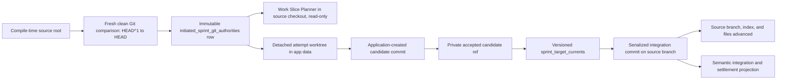

# Observation pass: application source checkout as productive Git authority

## Evidence boundary

This pass follows one Git identity through the committed operational spine at `924036424969de293da17d0e29c67c34d1ec7c81`. It records implementation, runtime consequences, configuration seams, history, and frontend projection. It does not recommend a disposition.

Source inspected: `C:\Users\user\.codex\worktrees\1ff1\Codex Orchestrator`.

| Snapshot fact | Observed value |
| --- | --- |
| Source tip | `9240364` - `Bind managed sessions to ready native profiles` |
| Worktree state | Clean, detached `HEAD` |
| Git top level | `C:/Users/user/.codex/worktrees/1ff1/Codex Orchestrator` |
| Git common directory | `C:/Users/user/Documents/Code Projects/Codex Orchestrator/.git` |
| `HEAD^1` | `dbe321d1fc0a5e9d777ebff933197c023b19782e` - `test: coordinate MCP selection race workers` |
| `HEAD` parent shape | One parent; not a merge commit |

The detached state matters only after authority binding. The application authority verifier accepts a detached clean checkout, but the first accepted-candidate target initialization requires a safe symbolic `refs/heads/...` `HEAD`. If a desktop binary were compiled from and run against this exact source checkout, planning authority could bind while accepted-candidate target initialization would later record `target_ref_detached_or_unsafe` and leave no integration target current.

## Central finding

The current productive desktop composition treats the checkout from which the Rust backend was compiled as the repository, planning worktree, initial execution source, and eventual accepted-integration target for every Sprint.

This is both deliberate architecture and a convergence bridge:

- The durable authority model is intentionally generic, private, fingerprinted, and fail-closed. It was first implemented around a prepared Worktree Runtime comparison.
- The productive adapter does not consume a user-selected repository or an actual prepared runtime instance. It synthesizes a per-Sprint runtime identity and derives all Git facts from `env!("CARGO_MANIFEST_DIR").parent()`.
- Later code deliberately builds isolated attempt worktrees, retained candidate refs, serialized integration commits, target-current versioning, restart adoption, and semantic frontend projection around that authority.
- The immutable Sprint authority and the mutable integration target are separate records. Current code still contains a convergence seam where new attempt authorization defaults to the immutable authority's original `current_object_id`, while later validation consults the mutable `sprint_target_currents` object.

In product terms, an initiated Epic does not currently bring its own target repository identity into this path. The executable's build-source checkout supplies it.

## Authority flow



Two meanings of current coexist:

| Meaning | Storage | Mutability | Use |
| --- | --- | --- | --- |
| Authority current | `initiated_sprint_git_authorities.current_object_id` | Immutable | Original `HEAD` at Sprint authority binding; part of authority fingerprints and replay checks |
| Target current | `sprint_target_currents.current_object_id` | Versioned and CAS-updated | Current accepted-integration parent and execution correlation after integrations |

## 1. Compile-time root resolution and Git assumptions

The productive desktop setup calls `SprintRunnerTransitionService::open_with_application_git_authority` in `src-tauri/src/active_app.rs:201-205`. The ordinary `open` path installs an unavailable authority runtime; only the productive constructor installs `ApplicationSprintGitAuthorityRuntime` and sets `application_git_authority_required=true` (`sprint_runner_transition.rs:1183-1224`).

`ApplicationSprintGitAuthorityRuntime::new` resolves its root with:

```text
env!("CARGO_MANIFEST_DIR") -> parent -> canonicalize
```

at `sprint_runner_transition.rs:4101-4115`. This is a compile-time string embedded by Cargo, not a runtime workspace selection. Canonicalization occurs during Tauri setup, before a Sprint asks for authority. A missing build-source path therefore fails application composition rather than only the later Sprint action.

`resolve_verified_comparison` at `sprint_runner_transition.rs:4133-4196` then makes the following runtime checks whenever an authority is first established or explicitly reauthorized:

- `git` must be callable from `PATH`; terminal prompting is disabled;
- the root must be inside a Git worktree;
- `git status --porcelain=v1 --untracked-files=all` must be empty;
- Git's canonical top level must equal the embedded source root;
- the repository common directory is resolved from Git;
- `current_object_id` is exactly `HEAD^{commit}`;
- `baseline_object_id` is exactly `HEAD^1^{commit}`;
- both object IDs must be lowercase 40- or 64-character hexadecimal and distinct.

The comparison therefore assumes:

- the source root still exists on the machine running the binary;
- it is the exact Git top level, not a subdirectory;
- it has no tracked or untracked changes;
- `HEAD` has a first parent;
- the desired Sprint comparison is the latest commit against its first parent;
- the same comparison is appropriate for every Sprint first bound while that checkout remains at that `HEAD`.

For a merge commit, `HEAD^1` would select the first parent and the comparison would include the merge result relative to that parent. No product or agent input selects a baseline, branch, repository, or worktree.

The runtime derives stable repository and worktree IDs from normalized root/common-directory strings and fingerprints root, common directory, baseline, and current with domain `application-sprint-git-authority/v1`. It stores the fixed source label `application-sprint-source-v1` (`sprint_runner_transition.rs:4173-4195`).

This source-root convention is also used by Harness skill discovery. `conversation_harness.rs:524-567` resolves the same `CARGO_MANIFEST_DIR` parent and verifies repository-local `.agents/product-skills/.../SKILL.md` files before returning a role working directory. The Git-authority bridge expands an existing source-tree runtime dependency into productive Git ownership.

## 2. Durable Sprint authority

The reusable boundary is in `orchestration/initiated_sprint_git_authority.rs`:

- `WorktreeRuntimeGitComparison` is a private port that returns verified repository, worktree, object, runtime, and fingerprint facts (`:16-36`).
- `InitiatedSprintGitAuthorityService::bind` accepts only Sprint ID, runtime instance reference, and idempotency key. It obtains all Git facts from the port and persists them (`:43-100`).
- `reauthorize` reloads the durable authority, asks the runtime for fresh facts, and requires every repository root, common directory, worktree, object ID, runtime identity, source label, and fingerprint to remain exact (`:102-135`).

The `initiated_sprint_git_authorities` table at `repository.rs:294-307` retains:

- Epic, Sprint, and initiation provenance ownership;
- repository ID, root, and common directory;
- worktree ID and root;
- immutable baseline and current object IDs;
- runtime instance/source references;
- source and payload fingerprints;
- idempotency identity and recorded time.

`store_initiated_sprint_git_authority` uses an immediate transaction, derives Epic/provenance from the initiated Sprint, and rejects a reused idempotency, authority, or runtime identity unless the entire fingerprint matches (`repository.rs:1798-1854`). Loads rejoin the live Sprint/Epic/provenance chain and recompute both the authority ID and payload fingerprint (`:1856-1897`). More than one authority row for a Sprint is a conflict (`:1900-1930`).

The productive bridge synthesizes:

- runtime instance: stable hash of `application-sprint-runtime` plus Sprint ID;
- authority idempotency: stable hash of `application-sprint-git-authority` plus Sprint ID.

`establish_planning_route_authority` binds a missing authority or calls `reauthorize` for an existing one, then checks the Sprint and synthetic runtime identity (`sprint_runner_transition.rs:1984-2035`). It is called when requesting a Work Slice Planner and when its MCP context is read. General startup reconciliation does not itself call this method for every existing Sprint.

Consequently, accepted integration can later move the source checkout away from the immutable authority `HEAD`; a subsequent planning request replay or planning-context read for that authority then conflicts on reauthorization. The immutable record is not advanced to the integrated target.

## 3. Planning uses the authority worktree directly

`request_work_slice_planner` snapshots the complete authority into `work_slice_planning_requests`: authority, Epic/provenance, repository/worktree IDs, baseline/current objects, source fingerprint, and `repository_worktree_route` (`sprint_runner_transition.rs:2211-2249`). Exact replay requires every field to match.

The route is `authority.worktree_root`, which in the productive adapter is the application source checkout. `reconcile_work_slice_planner` creates the Planner Agent Session with that route as its working directory and launches the invocation there (`:3787-3871`). The persisted planning episode repeats the authority and route correlation.

The Planner is configured read-only with approval policy `never` and four MCP tools in `conversation_harness_catalog.json:193-218`. The path therefore serves as an inspection and planning context, not as its write target. The Planner MCP context returns the repository route to the agent (`sprint_runner_transition.rs:3731-3770`).

This is an application/configuration mix:

- application authority decides which exact filesystem route the Session receives;
- the embedded Harness catalog determines read-only runtime behavior and MCP tools;
- the persisted request pins the route and Harness identity;
- the agent cannot submit a substitute repository identity.

## 4. Initial and later execution worktrees

Tauri setup constructs `ProductExecutionSupportState` with the common active SQLite database and `app_data_dir/execution-workspaces` (`active_app.rs:103-118`). This parent path is runtime application configuration; the exact child path is application-derived.

`ProductExecutionWorkspaceResolver` in `execution_support.rs:229-428` creates one deterministic worktree ID per Sprint authority plus attempt. It rejects symlinked parents, prevents an attempt root from equaling the repository or authority worktree, and validates that both roots share the recorded Git common directory.

For a new attempt it runs:

```text
git worktree add --detach <deterministic-attempt-root> <attempt-baseline>
```

The resulting worktree must be registered, detached, clean, rooted exactly where expected, and at the authorized baseline. If the process stopped after `git worktree add` but before the grant transaction committed, a later call adopts only the exact clean untouched worktree (`execution_support.rs:368-426`). Persisted `execution_support_grants` retain opaque capability, role, repository, workspace, and correlation fingerprints (`:24-51`, `:789-836`).

The Work Unit Handler is read-only; the Implementer is workspace-write (`conversation_harness_catalog.json:220-268`). Both receive an isolated attempt worktree rather than the source checkout. The source checkout remains Git routing authority and later integration target.

Attempt baseline selection is consequential:

- `authorize_existing_attempt` uses an explicit application-derived seed for a retry, otherwise `authority.current_object_id` (`execution_support.rs:601-673`).
- `current_target_object_id` separately reads `sprint_target_currents`, falling back to immutable authority current (`:675-702`).
- `load_authorized_attempt_for_role` requires the attempt baseline to equal that mutable current, except for a pinned retry candidate (`:704-758`).

After the first accepted integration advances `sprint_target_currents`, a newly authorized ordinary Handler or Implementer still receives the original immutable authority current as its default baseline, then fails the later mutable-current correlation unless it is the special pinned retry route. This is not only an inferred naming tension: the two-parent commit `9acf4d4` selected this combination from parents with different baseline models; see History below.

## 5. Candidate sealing and evidence capture

Codex workspace-write cannot write the protected worktree Git metadata. After the original Implementer invocation completes, the application calls `commit_implementer_candidate` (`sprint_runner_transition.rs:2468-2526`; `work_unit_execution_harness.rs:489-495`).

`ProductExecutionWorkspaceResolver::commit_candidate` at `execution_support.rs:514-559`:

- revalidates the exact granted workspace and baseline;
- accepts replay only when an existing candidate commit has exactly one parent equal to the baseline and the worktree is clean;
- otherwise stages all changes;
- creates one commit with fixed local identity `Codex Orchestrator <codex-orchestrator@local.invalid>`, `--no-verify`, and message `Work Unit candidate <attempt-id>`;
- requires the resulting commit's parent to equal the attempt baseline and the worktree to be clean.

Inspection at `execution_support.rs:443-511` derives a File Review capture authorization from the exact worktree, baseline, and candidate `HEAD`. The Git producer creates the bounded comparison and changed-file evidence. Harness-facing calls retain only an opaque capability and semantic intents; paths, refs, object IDs, and role identity stay application-owned (`execution_support.rs:113-169`, `:885-927`).

For a returned Work Unit, the coordinator derives the candidate commit/tree from the prior attempt, pins it under `refs/codex-orchestrator/retry/...`, and authorizes the next detached Implementer worktree at that exact commit (`sprint_runner_transition.rs:3020-3161`). This later attempt is allowed to diverge from `sprint_target_currents` only because the pinned retry row proves the seed.

## 6. Accepted candidate retention

`accepted_candidate_authority.rs` turns an accepted Handler decision into private retained candidate authority. It has no transport surface.

The reconciliation joins the exact accepted decision, terminal review, Implementer outcome, execution authorization/grant, File Review capture authorization, immutable document link, and Sprint authority (`:90-125`). It revalidates:

- clean attempt worktree and exact repository/common-directory identity;
- candidate `HEAD` and candidate tree;
- descent from the attempt baseline;
- capture authorization fingerprint;
- document/artifact membership;
- comparison, manifest, and per-file content fingerprints (`:294-380`).

It then persists `accepted_handler_candidates` and atomically pins the candidate under `refs/codex/orchestrator/accepted/<candidate-id>` (`:174-291`). After that pin, reopen validation uses durable evidence plus the private ref/object; it no longer depends on the attempt worktree (`:146-171`).

The first retained candidate also initializes `sprint_target_currents` (`:399-459`). Initialization reads the authority worktree's symbolic `HEAD`, requires a safe branch ref, clean worktree, exact original authority current, and matching common directory. The initial mutable target is therefore the same branch and `HEAD` from the compile-time source checkout. Detached `HEAD` is explicitly retained as attention rather than silently choosing a branch.

## 7. Accepted integration advances the source checkout

`accepted_integration.rs` is application-owned and has no Tauri or MCP command (`:1`). It operates as a persisted state machine:

```text
intent_reserved -> object_created -> ref_advanced -> runtime_advanced -> db_advanced -> settled
                                                                  \-> attention
```

Key behavior:

1. `reserve` snapshots target ref, target current/version, candidate commit/tree, attempt baseline, and intent fingerprint in an immediate SQLite transaction (`:149-162`).
2. A lock file in the Git common directory serializes integration by target ref across processes (`:114-146`, `:313`).
3. `merged_tree` performs a three-way `read-tree -m` with attempt baseline, current target parent, and candidate commit in a temporary index (`:298`).
4. `create_commit` makes a deterministic, single-parent integration commit whose parent is the current target object. It preserves candidate author identity/date, uses the Orchestrator as committer, and embeds policy, evidence, candidate, baseline, Work Unit, authority, target, parent, tree, and fingerprint in the message (`:300-306`).
5. `update-ref <target> <integration> <pre>` advances the source branch by compare-and-swap (`:172-190`).
6. `git read-tree --reset -u <integration>` advances the authority worktree's index and files to the integration commit (`:208-215`).
7. `sprint_target_currents` advances object, fingerprint, and version with a database CAS (`:251-259`).
8. Evidence, Work Unit settlement, and dependency contributions are persisted before the state becomes `settled` (`:261-278`).

The target source checkout is thus not merely inspected. Successful accepted integration mutates its branch ref, index, working files, and `HEAD` through application-owned Git commands.

The integration engine can serialize two candidates against successively reloaded target parents. Each result is a new linear commit on the source branch; it is not a merge commit with the candidate as a second parent. The candidate survives separately under its private ref.

## 8. Restart and interruption behavior

The productive design assumes durable SQLite and Git effects can be split by process interruption.

Execution workspaces:

- deterministic IDs and roots allow exact re-resolution;
- stored grants are revalidated against repository/common-dir/baseline fingerprints;
- an unrecorded worktree-add effect can be adopted only while clean, detached, and exactly at baseline (`execution_support.rs:315-426`, `:789-836`).

Accepted candidates:

- database intent precedes `update-ref`;
- replay accepts only the exact private ref target and tree;
- durable lineage is rechecked without depending on the attempt worktree after pinning (`accepted_candidate_authority.rs:174-291`).

Accepted integration:

- stage timestamps distinguish object creation, ref advance, runtime/index advance, database advance, evidence, and settlement;
- reopen can adopt an exact owned ref effect before its stage write or an exact clean runtime effect after it;
- ambiguous or foreign states become attention, while lock/database contention remains retryable (`accepted_integration.rs:114-215`, `:283-309`).

Desktop startup first reconciles Agent Sessions, composes execution support, bootstrap, and Sprint services, then calls the Sprint operational-spine reconciler (`active_app.rs:95-226`). `SprintRunnerTransitionService::reconcile_startup` observes known terminals and drains Handlers, outcomes, reviews, retries, handbacks, escalation, accepted candidates, accepted integrations, dependency waves, settlement, and newly eligible Handlers (`sprint_runner_transition.rs:1652-1694`). That startup pass can therefore create or adopt attempt worktrees and can advance the application source checkout without a frontend command in the same process lifetime.

Reauthorization has a different boundary. The general startup drain trusts and revalidates persisted/Git correlations inside each subsystem, but it does not rerun `ApplicationSprintGitAuthorityRuntime` for every Sprint. The original `HEAD^1`/`HEAD` comparison is freshly compared only when the planning authority establishment path is entered again.

## 9. Frontend-visible consequences and Tauri split

No Tauri command accepts a repository root, branch, object ID, candidate, integration target, or execution-worktree path for this flow. Git mutation is internal Rust behavior entered through application reconciliation and persisted Agent lifecycle callbacks.

Two read surfaces expose different levels of detail.

### Sprint transition query exposes the planning route

`load_sprint_runner_transition_query` is a thin Tauri command over the Rust service query (`orchestration/transport.rs:470-475`). The DTO includes `work_slice_planner_repository_worktree_route` (`sprint_runner_transition.rs:1090-1110`, `:1715-1760`). The frontend decoder retains it as `workSlicePlannerRepositoryWorktreeRoute` (`src/application/orchestrations/sprintRunnerTransition.ts:25-50`, `:280-350`).

No production TypeScript view currently reads that field outside the application model/decoder. It is nevertheless frontend-delivered and contains the exact build-source checkout path.

### Native query deliberately redacts Git authority

`load_orchestration_native_query` calls the application/repository snapshot (`transport.rs:355-361`; `application.rs:679-680`). The productive integration DTO explicitly keeps candidate, Git, authority, and repository correlations private and emits only:

- requested/authorized time;
- semantic progress `preparing`, `applying`, or `recording`;
- bounded attention `integration_conflict` or `integration_failure`;
- success;
- Work Unit settlement;
- prerequisite contribution count (`repository.rs:3152-3185`, `:4389-4434`).

The TypeScript decoder enforces temporal ordering and rejects attention combined with success/settlement/contribution (`nativeQuery.ts:1433-1445`). It also requires productive integration to belong to the final accepted attempt (`:2920-2932`). `WorkUnitDetailWorkspace.tsx:660-670` presents the semantic state and never displays source paths, refs, commits, or target versions.

From a Tauri/backend perspective, Tauri owns composition and snapshot transport. The Rust orchestration services own authority derivation, Git commands, persistence, stage reconciliation, and mutation. The frontend can observe some consequences but cannot initiate or parameterize the Git operation directly.

## 10. Configuration versus runtime authority

| Element | Kind | Exact role |
| --- | --- | --- |
| `env!("CARGO_MANIFEST_DIR").parent()` | Compile-time configuration | Selects the only productive Sprint repository/worktree root |
| `git` executable name and process environment | Runtime dependency with code-defined configuration | Git is resolved from `PATH`; prompting is disabled; integration also suppresses system/global config |
| `HEAD^1` and `HEAD` | Code-defined comparison policy resolved at runtime | Becomes immutable authority baseline/current |
| `application-sprint-source-v1` and fingerprint domains | Code configuration | Version and namespace deterministic identities/fingerprints |
| Synthetic runtime/idempotency hashes per Sprint | Application-derived configuration | Stand in for a real prepared Worktree Runtime instance on the productive route |
| `initiated_sprint_git_authorities` | Durable runtime authority | Owns the immutable Sprint/Epic/provenance-to-Git relation |
| `repository_worktree_route` in planning request | Durable runtime route copied from authority | Determines Planner Session working directory |
| Harness catalog read-only/workspace-write settings | Embedded declarative configuration | Constrains Planner/Handler/Implementer runtime behavior |
| `app_data_dir/execution-workspaces` | Runtime application configuration | Parent for deterministic detached attempt worktrees |
| `execution_support_attempt_authorizations` and grants | Durable runtime authority | Bind attempt, role, baseline, capability, workspace, and correlation |
| Candidate commit identity/message | Code policy applied at runtime | Lets the application seal provider changes into Git |
| Private retry/accepted ref namespaces | Code policy plus runtime Git state | Retain exact candidate objects outside the target branch |
| `sprint_target_currents` | Mutable durable runtime authority | Names and versions the branch/object that accepted integration may advance |
| Accepted integration policy/committer/message | Code policy applied at runtime | Determines merge-tree and integration commit identity |
| Integration stages/evidence/settlements | Durable runtime facts | Support restart recovery and semantic frontend projection |
| Tauri query commands | Application transport | Expose route/status snapshots; do not carry Git mutation authority |

## 11. Historical interpretation

The chronology separates the intended abstraction from the productive bridge.

| Date | Commit | Historical signal |
| --- | --- | --- |
| 2026-08-01 | `e970e35` `feat: bind initiated sprint git authority` | Adds the generic verified-comparison port, durable authority/fingerprints, restart reauthorization tests, and a real adapter on `HumanReviewLauncherService` for a prepared Worktree Runtime instance. |
| 2026-08-01 | `a6140de` `feat: originate File Review from Sprint authority` | Makes the private authority productive for Git-backed review. |
| 2026-08-02 | `b964509` `Bind planning request to Sprint Git authority` | Replaces Planner role-discovery root with a pre-existing authority worktree and snapshots all authority fields. Product composition still cannot create a missing authority. |
| 2026-08-02 | `8804d5e` through `39aaf9a` | Adds execution-support authority, attempt baselines, clean evidence gates, detached attempt worktrees, and interrupted-grant adoption. |
| 2026-08-04 | `2453a68` through `85a1ace` | Adds accepted candidate retention, private refs, source-target initialization, integration, recovery, concurrency, and projection. |
| 2026-08-04 | `9acf4d4` `Converge dependent execution and attempt progression` | Two-parent convergence combines evolving-target ordinary attempts from one parent with explicit retry seeds from the other. The merge result defaults ordinary attempts to immutable `authority.current_object_id` while retaining later validation against mutable target current. |
| 2026-08-04 | `7b2cc5d` `Correct execution convergence privacy and recovery` | Adds the pinned-retry exception to mutable-target validation; ordinary post-integration attempts remain outside that exception. |
| 2026-08-05 | `5555e02` `fix: bind sprint Git authority before planning` | Promotes the compile-time application source checkout into productive composition and auto-binds it when planning first needs authority. This lands after the execution/candidate/integration machinery. |

`HumanReviewLauncherService` remains an implementation of the same `WorktreeRuntimeGitComparison` port (`worktree_review/service.rs:39-119`). It resolves a prepared runtime instance, catalog compatibility, selected worktree, repository common directory, verified clean state, baseline, current, and source fingerprint. The productive Sprint composition does not wire this adapter; it wires `ApplicationSprintGitAuthorityRuntime` instead.

This supports a two-part reading:

- **Deliberate architecture:** opaque application-owned authority; exact durable lineage; isolated workers; retained refs; CAS integration; restart-safe stage boundaries; redacted frontend semantics.
- **Convergence bridge:** compile-time source selection; synthetic runtime/source identities; fixed one-commit comparison; product startup dependence on build-source availability; late promotion of the application checkout; and surviving immutable-current versus mutable-current attempt semantics from branch convergence.

## 12. Role-oriented reading

### Product owner

The operational spine can plan against code, isolate implementation, capture evidence, accept a candidate, integrate it into a branch, settle a Work Unit, and unlock dependencies. The implicit product scope is currently the application's own build-source checkout rather than a selected customer/project workspace. Product-visible copy shows semantic integration and settlement, not that the application branch and working files were changed.

### Product architect

The reusable authority boundary is stronger and more general than its productive adapter. The system separates immutable Sprint origin authority, per-attempt workspace authority, retained candidate authority, mutable target-current authority, and integration settlement. The source-checkout adapter collapses repository selection, planning context, target branch ownership, Harness discovery root, and application build provenance into one filesystem location.

### Expert developer

The implementation is a multi-store state machine spanning SQLite, Git refs/objects, registered worktrees, index/working files, loopback MCP lifecycle, and Agent Session lifecycle. Recovery is intentionally exact and mostly fail-closed. The most consequential code-level seams are compile-time path capture, `HEAD^1` policy, target branch requirement appearing only at first candidate retention, source worktree mutation during integration, reauthorization against immutable original `HEAD`, and ordinary attempt baseline selection after target advancement.

### Expert designer

The visible model intentionally compresses Git mechanics into request, authorization, progress, attention, success, settlement, and dependent contribution. That supports calm product language, but the same transition query also transports the raw Planner filesystem path even though no current view renders it. A later representation can distinguish the invisible operational layer from the user-facing semantic layer without treating either as the complete truth.

## 13. Artifact index

| Artifact | Main responsibility in this chain |
| --- | --- |
| `src-tauri/src/active_app.rs:95-226` | Product composition, execution workspace parent, productive source authority adapter, startup ordering |
| `src-tauri/src/orchestration/initiated_sprint_git_authority.rs:8-177` | Generic comparison port, bind, reauthorize, error taxonomy |
| `src-tauri/src/orchestration/repository.rs:294-307,1798-1930,2272-2355` | Durable authority schema, ownership joins, idempotency and fingerprint validation |
| `src-tauri/src/orchestration/sprint_runner_transition.rs:1164-1224,1984-2035` | Product/generic service constructors and planning authority establishment |
| `src-tauri/src/orchestration/sprint_runner_transition.rs:2211-2249,3731-3871` | Authority-bound planning request, context, Session, invocation and launch |
| `src-tauri/src/orchestration/sprint_runner_transition.rs:4089-4196` | Compile-time application-source Git verifier |
| `src-tauri/src/orchestration/execution_support.rs:24-51,229-569,601-927` | Attempt authorization, detached worktree lifecycle, candidate commit, bounded evidence capability |
| `src-tauri/src/orchestration/work_unit_execution_harness.rs:430-495` | Role package construction and application-only execution/candidate seams |
| `src-tauri/src/orchestration/conversation_harness.rs:499-567` | Runtime options and compile-time repository skill/discovery root |
| `src-tauri/src/orchestration/conversation_harness_catalog.json:193-268` | Planner, Handler, and Implementer declarative runtime/MCP configuration |
| `src-tauri/src/orchestration/accepted_candidate_authority.rs:11-171,174-459` | Candidate lineage, private accepted ref, target-current initialization |
| `src-tauri/src/orchestration/accepted_integration.rs:11-318` | Integration schema, locking, merge tree, commit, ref/runtime/DB advancement, recovery and settlement |
| `src-tauri/src/worktree_review/service.rs:39-119` | Earlier prepared-runtime implementation of the generic Git comparison port |
| `src-tauri/src/orchestration/transport.rs:355-361,470-475` | Tauri snapshot commands only |
| `src/application/orchestrations/sprintRunnerTransition.ts:25-50,280-350` | Frontend retention of exact Planner worktree route |
| `src/application/orchestrations/nativeQuery.ts:1433-1445,2920-2932` | Strict semantic integration decoder and correlations |
| `src/features/orchestrations/components/WorkUnitDetailWorkspace.tsx:660-670` | Visible integration/settlement/attention presentation |

## Confidence and limits

High confidence:

- exact productive constructor and compile-time root derivation;
- clean/`HEAD^1`/`HEAD` binding assumptions;
- immutable authority persistence and planning replay checks;
- direct Planner use of the source checkout;
- detached isolated attempt worktrees and application-created candidate commits;
- private accepted refs and mutable target-current initialization;
- application-owned mutation of the source branch, index, working files, and target-current row;
- restart recovery stages and frontend redaction/projection;
- historical order and two-parent convergence behavior.

Not claimed:

- that a packaged release has successfully exercised this route;
- that the inspected detached `1ff1` checkout was the source root of any already-running binary;
- that every historical branch intention can be recovered from commit subjects alone;
- that the retained attention/failure paths have been observed in a live provider run;
- any keep, tune, prune, segment, centralize, or refactor decision.
